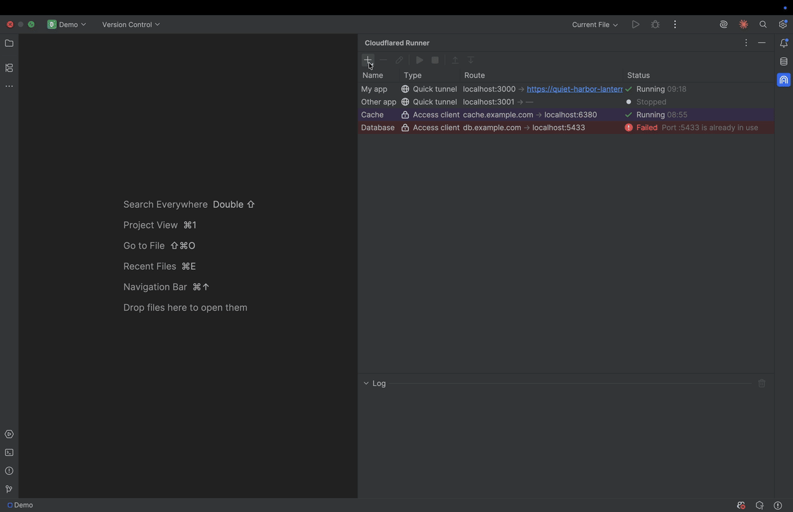
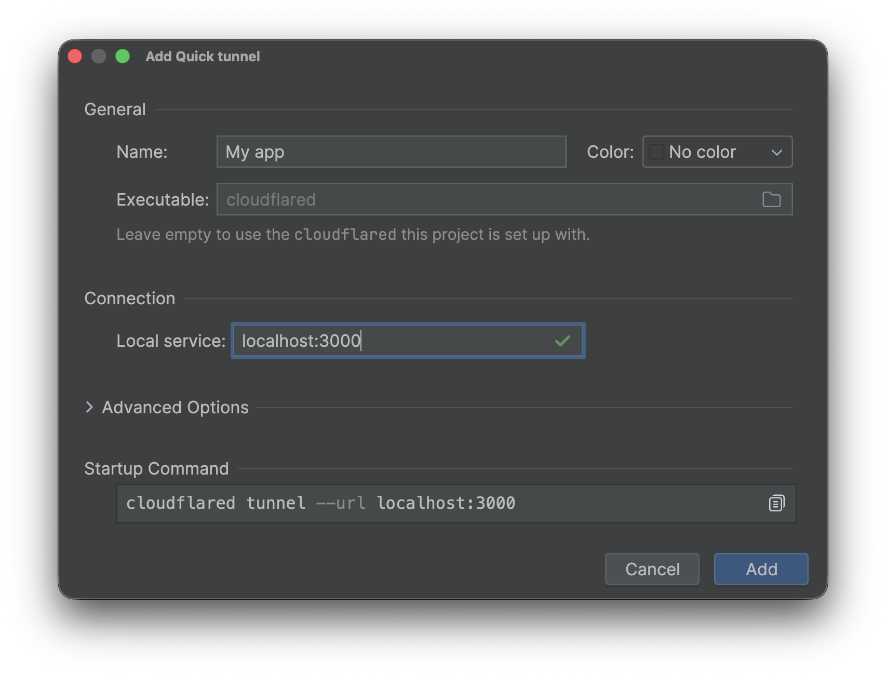
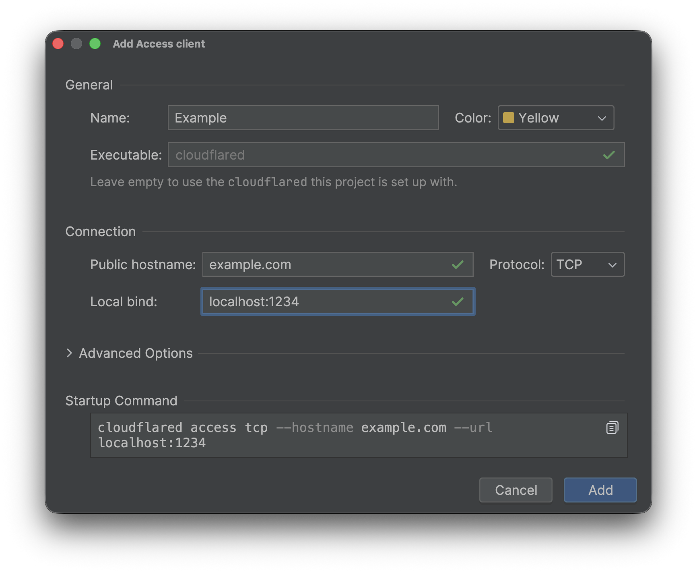
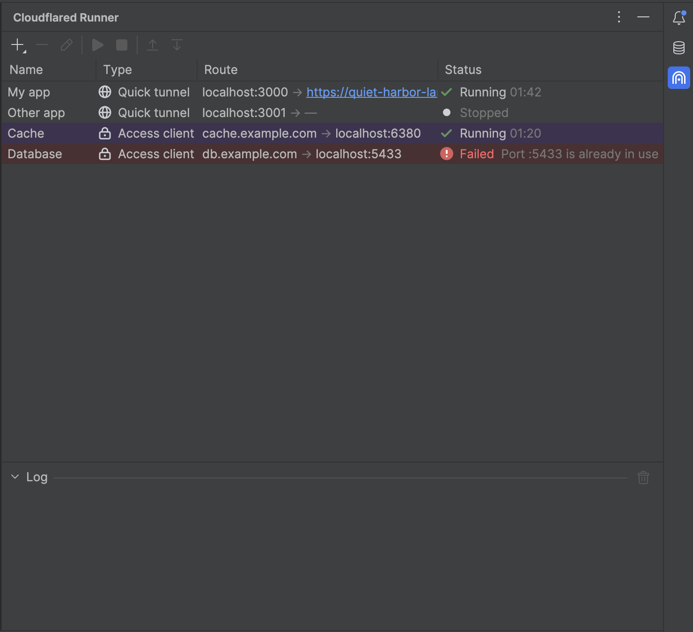

<h1>
  <picture>
    <source media="(prefers-color-scheme: dark)" srcset="src/main/resources/META-INF/pluginIcon_dark.svg">
    
  </picture>
  Cloudflared Runner
</h1>

An IntelliJ IDEA plugin that runs `cloudflared` from a tool window instead of a terminal tab.

Add a connection, hit start, and the plugin spawns the process, streams its output into a console,
and shows both ends of the connection in a table. Closing the project kills every running process.



## Connection types

| Type | Command | Route shown |
| --- | --- | --- |
| **Quick tunnel** | `cloudflared tunnel --url <target>` | `localhost:8080 → abc.trycloudflare.com`, the hostname scraped from stderr |
| **Access client** | `cloudflared access <proto> --hostname <host> --url <bind>` | `db.example.com → localhost:5433` |

The route column always reads *service → the address that reaches it*. The two types run traffic in
opposite directions, so labelling the ends "from" and "to" would mean opposite things on adjacent
rows; this order holds for both.

A quick tunnel is anonymous and ephemeral — no account, no login. An access client is the *client*
side of Cloudflare Access: it opens a local listener in front of a service that already sits behind
an Access policy. It does not create a tunnel.

Each type gets its own form, since they have little in common beyond a name and a colour. Every
address is checked as you type — reachable, resolvable, port free — and the exact command that will
be run is shown at the bottom, ready to copy.

| Quick tunnel | Access client |
| --- | --- |
|  |  |

## Authentication

The plugin never touches credentials. `cloudflared` opens the browser, catches the loopback
redirect, and caches its own short-lived token under `~/.cloudflared/`. The plugin only streams
output, so login prompts stay visible — including the manual auth URL cloudflared prints when it
cannot open a browser (headless or remote sessions). That case shows up in the status column as
"Authorization required", which is a link straight to the URL cloudflared printed.

## Requirements

`cloudflared` on `PATH`, or an explicit path in a connection's **Executable** field. Either way the
dialog runs `--version` against it as you type and says so before you save — whether it is missing,
or is some other program that answered with something other than a cloudflared version banner.

## Usage

Open the **Cloudflared Runner** tool window on the right edge.

- **+** adds a connection; pick *Quick tunnel* or *Access client*, since their forms differ.
- Select a row and use ▶ / ■ in the toolbar to start and stop it. Double-clicking a row edits it.
- Right-click → **Addresses** opens or copies the row's public URL or local address. A running quick
  tunnel's hostname is also a link in the route column.
- The lower pane is that connection's console — output is per connection and survives stopping.
- A connection can carry a colour, which tints its row; useful once the list gets long.



Connections are stored per project in `.idea/cloudflaredRunner.xml`.

## Non-goals

No Cloudflare API calls, no named tunnels, no `config.yml`, no `~/.cloudflared/` parsing, no
`cloudflared tunnel login` flow. This wraps the CLI and manages child processes; that is all.

## Development

```bash
./gradlew check         # ktlint + unit tests (output parsing, argument vectors)
./gradlew ktlintFormat  # fix formatting violations in place
./gradlew runIde        # sandbox IDE with the plugin installed
./gradlew buildPlugin   # distributable zip in build/distributions
./gradlew verifyPlugin  # IntelliJ Plugin Verifier against recommended IDEs
```

CI (`.github/workflows/build.yml`) runs `check` + `verifyPluginProjectConfiguration` and
builds the plugin on every push and pull request, then runs the Plugin Verifier in a second
job. Pushing a `v*` tag builds the zip and attaches it to a GitHub Release
(`.github/workflows/release.yml`); Marketplace publishing is not wired up.

Source layout:

```
src/main/kotlin/com/noisebomb/cloudflared/
├── model/Connections.kt          Connection config, type, colour, live state
├── service/
│   ├── TunnelService.kt          Project service: connection list, process lifecycle, persistence
│   ├── CloudflaredOutput.kt      Parsing of the few meaningful output lines
│   ├── CloudflaredBinary.kt      `--version` probe behind the Executable field
│   └── HostProbe.kt              Socket, DNS and HTTP checks used by the dialog's validation
└── ui/
    ├── TunnelToolWindowFactory.kt
    ├── TunnelPanel.kt            Table of connections + per-connection console
    ├── ConnectionDialog.kt       Add/edit form, with live validation of every address
    ├── CommandPreview.kt         The copyable startup command shown in the dialog
    ├── ConnectionColors.kt       Row tints and swatches
    └── CloudflaredIcons.kt       Type and status icons
```

Built with the [IntelliJ Platform Gradle Plugin][gradle-plugin], targeting IntelliJ 2025.3 (build
253) and later.

## Trademarks

Not affiliated with Cloudflare, Inc. "Cloudflare" and "cloudflared" are trademarks of Cloudflare,
Inc.; they are used here only to describe what this plugin runs.

[gradle-plugin]: https://plugins.jetbrains.com/docs/intellij/tools-intellij-platform-gradle-plugin.html
